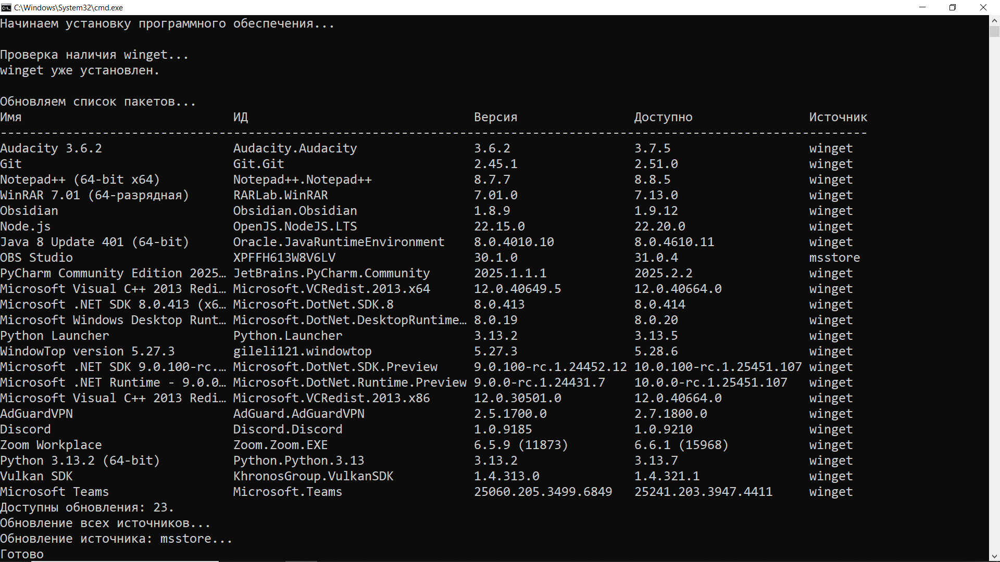
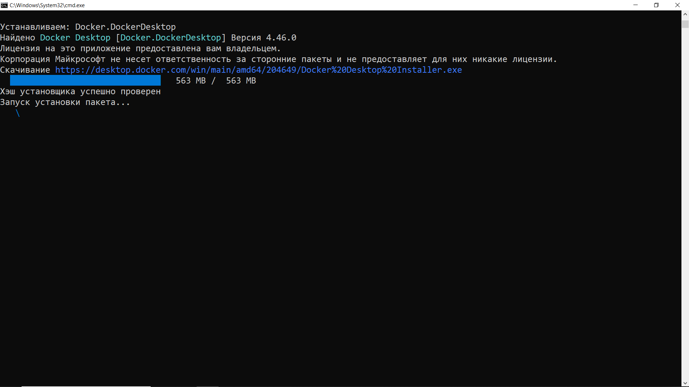
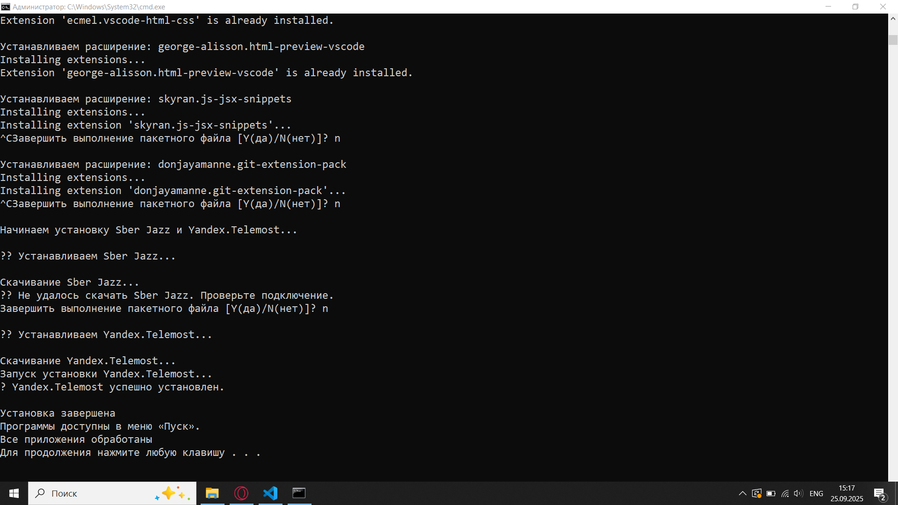

**Отчет по разработке скрипта автоматизации установки и удаления программного обеспечения в компьютерных аудиториях**

---

### **1. Введение**

В рамках задачи по автоматизации процесса настройки компьютеров в учебных аудиториях кафедры информационных технологий и электронного обучения была разработана система скриптов для Windows, позволяющая:
- Автоматически устанавливать необходимое прикладное программное обеспечение (ПО).
- Минимизировать ручное вмешательство администратора.
- Обеспечить единообразную конфигурацию всех рабочих станций.

Для реализации использовались PowerShell-скрипты, как наиболее эффективный инструмент администрирования в среде Windows.

---

### **2. Поставленные задачи**

1. Анализ списков ПО:
   - `https://disk.yandex.ru/i/lmPLlMgm7NfsBQ` — список программ для установки.
2. Разработка универсального скрипта автоматизации:
   - Установка новых программ с использованием пакетного менеджера `winget`.
3. Обеспечение отказоустойчивости: обработка ошибок, логирование действий.
4. Подготовка отчёта с описанием и кодом.

---

### **3. Используемые технологии**

- **PowerShell 7+** — основной язык скриптов.
- **winget** — официальный пакетный менеджер Microsoft для Windows.
- **Get-WmiObject / Get-CimInstance** — для поиска установленных программ.
- **Start-Process** — для запуска установщиков с правами администратора.

---

### **4. Описание входных данных**

#### Файл `DownloadPrograms_Windows.txt`
Содержит список программ в формате:
```
Mozilla.Firefox
Microsoft.VisualStudioCode
Google.Chrome
Notepad++.Notepad++
GIMP.GIMP
...
```
Это идентификаторы пакетов из репозитория winget.


---

### **5. Листинг скрипта автоматизации**

```powershell
@echo off
chcp 1251 >nul
setlocal enabledelayedexpansion
cls
::========================================================================
:: Скрипт для автоматической установки/обновления Winget и ПО в Windows
:: Требует запуска "От имени администратора"
::========================================================================


echo Начинаем установку программного обеспечения...
echo.

:: Проверка прав администратора
net session >nul 2>&1
if %errorLevel% NEQ 0 (
    echo.
    echo ? Ошибка: Требуются права администратора.
    pause
    exit /b
)
echo Проверка наличия winget...

:: Проверяем, доступен ли winget
where winget >nul 2>&1
if %errorLevel% EQU 0 (
    echo winget уже установлен.
) else (
    echo winget не найден. Выполняем установку...
    call :InstallWinget
    if %errorLevel% NEQ 0 goto ErrorExit
)
echo.
echo Обновляем список пакетов...
winget upgrade
winget source update


:: Список программ для установки (через их PackageIdentifier)
:: Можно добавить свои из https://winget.run
set "programs=MaximaTeam.Maxima Microsoft.VisualStudioCode Docker.DockerDesktop JetBrains.PyCharm.Community Git.Git GitHub.GitHubDesktop KNIMEAG.KNIMEAnalyticsPlatform GIMP.GIMP JuliaLang.Julia Python.Python.3 Rustlang.Rustup MSYS2.MSYS2 Zettlr.Zettlr MiKTeX.MiKTeX Chocolatey.Chocolatey TeXstudio.TeXstudio Anaconda.Anaconda3 FarManager.FarManager SumatraPDF.SumatraPDF Google.Chrome Flameshot.Flameshot Canonical.Ubuntu.2204 Qalculate.Qalculate Quadren.Arc.Prerelease 7zip.7zip Mozilla.Firefox Yandex.Browser Microsoft.Edge"

echo.
echo Начинаем установку приложений:
echo.

for %%p in (%programs%) do (
    echo Устанавливаем: %%p
    winget install --id "%%p" --silent --accept-package-agreements --accept-source-agreements --force
    if !errorlevel! EQU 0 (
        echo Успешно установлен: %%p
    ) else (
        echo Ошибка при установке: %%p
    )
    echo.
)


::============================================
:: УСТАНОВКА РАСШИРЕНИЙ ДЛЯ VISUAL STUDIO CODE
::============================================
echo.
echo Устанавливаем расширения для Visual Studio Code...
echo.

set "VSCODE_BIN=%LOCALAPPDATA%\Programs\Microsoft VS Code\bin"
set "PATH=%PATH%;%VSCODE_BIN%"

where code >nul 2>&1
if %errorLevel% NEQ 0 (
    echo ?? Ошибка: Команда 'code' не найдена.
    goto JazzInstall
)

set "EXTENSIONS=ms-python.python ms-python.debugpy ms-python.vscode-python-envs ms-vscode.cpptools ms-vscode.cpptools-extension-pack ms-vscode.cpptools-themes ms-azuretools.vscode-docker sidthesloth.html5-boilerplate ecmel.vscode-html-css george-alisson.html-preview-vscode skyran.js-jsx-snippets donjayamanne.git-extension-pack"

for %%e in (%EXTENSIONS%) do (
    echo Устанавливаем расширение: %%e
    call code --install-extension "%%e" --force
    echo.
)


echo Начинаем установку Sber Jazz и Yandex.Telemost...
echo.

:: Временная папка
set "TEMP_DIR=%TEMP%\installer_temp"
if exist "%TEMP_DIR%" rd /s /q "%TEMP_DIR%"
mkdir "%TEMP_DIR%"

cd /d "%TEMP_DIR%"


::============================================
:: УСТАНОВКА: Sber Jazz
::============================================
:JazzInstall
echo ?? Устанавливаем Sber Jazz...
echo.

:: Прямая ссылка на установщик Sber Jazz (проверена на 2025)
set "JAZZ_URL=https://dl.salutejazz.ru/desktop/latest/jazz.exe"
set "JAZZ_EXE=%TEMP_DIR%\SberJazzSetup.exe"

echo Скачивание Sber Jazz...
powershell -Command "Invoke-WebRequest -Uri '%JAZZ_URL%' -OutFile '%JAZZ_EXE%' -ErrorAction Stop" || (
    echo ?? Не удалось скачать Sber Jazz. Проверьте подключение.
    goto TelemostInstall
)

echo Запуск установки Sber Jazz...
start /wait "" "%JAZZ_EXE%" /S /allusers
if %errorlevel% EQU 0 (
    echo ? Sber Jazz успешно установлен.
) else (
    echo ?? Установка Sber Jazz завершилась с ошибкой или пропущена.
)


::============================================
:: УСТАНОВКА: Yandex.Telemost
::============================================
:TelemostInstall
echo.
echo ?? Устанавливаем Yandex.Telemost...
echo.

set "TELEMOST_URL=https://github.com/huksleva/practice-2/raw/refs/heads/main/ИСР%%202/TelemostSetup.exe"
set "TELEMOST_EXE=%TEMP_DIR%\TelemostSetup.exe"

:: Удаляем лишние пробелы в URL
set "TELEMOST_URL=%TELEMOST_URL: =%"

echo Скачивание Yandex.Telemost...
powershell -Command "Invoke-WebRequest -Uri '%TELEMOST_URL%' -OutFile '%TELEMOST_EXE%'" || (
    echo ?? Ошибка при скачивании Yandex.Telemost.
    echo    Проверьте интернет или URL файла.
    goto Cleanup
)

echo Запуск установки Yandex.Telemost...

:: Запуск установки
start /wait "" "%TELEMOST_EXE%" /verysilent /allusers


if %errorlevel% EQU 0 (
    echo ? Yandex.Telemost успешно установлен.
) else (
    echo ?? Установка Yandex.Telemost завершилась с ошибкой.
)

echo.
echo Установка завершена!
echo Программы доступны в меню «Пуск».
echo Все приложения обработаны!
pause
exit /b


::--------------------------------------------------------
:: Подпрограмма: Установка Winget
::--------------------------------------------------------
:InstallWinget
    echo Скачивание Microsoft.DesktopAppInstaller...

    :: Временный путь
    set "TEMP_FILE=%TEMP%\DesktopAppInstaller.msixbundle"
    set "LOGO_URL=https://api.github.com/repos/microsoft/winget-cli/releases/latest"
    set "DOWNLOAD_URL="

    :: Используем PowerShell для получения последней ссылки на msixbundle
    for /f "tokens=*" %%i in ('powershell -Command "Invoke-RestMethod '%LOGO_URL%' | Select-Object -ExpandProperty assets | Where-Object { $_.name -like '*.msixbundle*' } | Select-Object -ExpandProperty browser_download_url"') do (
        set "DOWNLOAD_URL=%%i"
    )

    if "!DOWNLOAD_URL!"=="" (
        echo Не удалось получить ссылку для скачивания DesktopAppInstaller.
        exit /b 1
    )

    :: Скачиваем файл
    powershell -Command "Invoke-WebRequest -Uri '!DOWNLOAD_URL!' -OutFile '!TEMP_FILE!'"
    if %errorLevel% NEQ 0 (
        echo Ошибка при скачивании файла.
        exit /b 1
    )

    echo Установка пакета AppInstaller...
    powershell -Command "Add-AppxPackage -Path '!TEMP_FILE!'"
    if %errorLevel% NEQ 0 (
        echo Ошибка при установке пакета.
        del "!TEMP_FILE!" >nul 2>&1
        exit /b 1
    )

    del "!TEMP_FILE!" >nul 2>&1
    echo winget успешно установлен!
exit /b 0

::--------------------------------------------------------
:: Обработка ошибки
::--------------------------------------------------------
:ErrorExit
    echo.
    echo Произошла ошибка при установке winget.
    echo Убедитесь, что есть подключение к интернету.
    pause
exit /b 1
```

---

### **6. Скриншоты работы программы**




---

### **7. Комментарии по выполнению**

#### Преимущества подхода:
- **winget** позволяет устанавливать программы без скачивания установщиков вручную.
- Скрипт использует стандартные средства Windows (PowerShell, WMI), что исключает зависимость от сторонних библиотек.
- Поддержка логирования (`Start-Transcript`) помогает в диагностике проблем.
- Гибкость: легко обновлять списки ПО, просто меняя текстовые файлы.

#### Ограничения и рекомендации:
1. **Права администратора**: скрипт должен запускаться от имени администратора.
2. **Сеть**: требуется стабильное интернет-соединение для загрузки ПО через `winget`.
4. **winget list vs Win32_Product**: метод `Win32_Product` может быть медленным и вызывать ребут индексации WMI. В будущем можно заменить на `Get-ItemProperty HKLM:\Software\...\Uninstall\*`, но он менее универсален.
5. **Тестирование**: перед массовым применением скрипт следует протестировать на одной машине.

#### Возможные улучшения:
- Добавить GUI (например, с помощью `Windows Forms`).
- Реализовать централизованное развертывание через Group Policy или MDT.
- Интеграция с системой мониторинга (например, отправка отчета по email).

---

### **8. Заключение**

Разработанный PowerShell-скрипт позволяет эффективно и быстро настраивать компьютеры в учебных аудиториях, обеспечивая:
- Единообразие программного окружения.
- Снижение времени настройки с нескольких часов до 15–30 минут.
- Минимизацию человеческого фактора.


---

**Подпись:**  
Тоц Леонид Александрович
ИВТ-2
Кафедра информационных технологий и электронного обучения  
